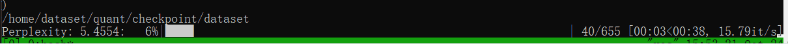
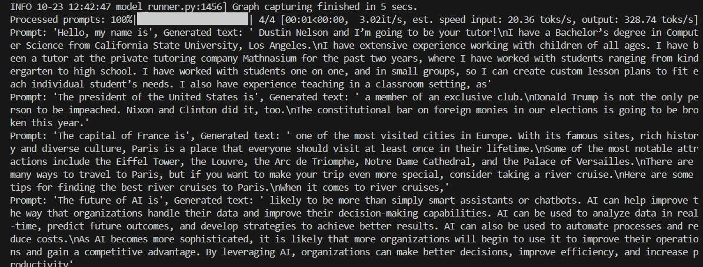

# Mixed-precision Inference In VLLM

The mixed-precision inference is used for accelerating prefill steps and for enhancing throughput of LLM.


## Comparision with AWQ

Assuming we have a task that is to compute the PPL(perplexity) of Wikitext2. 
The dataset wikitext contains 333088 validation data.

For ```batch size  = 32```, the task is devided into 10409 parts.

AWQ finished the task in 10 minutes with  16.71 it/s.


MixQ   finished the task in 4.50 minutes with 35.02 it/s.


For ```batch size  = 512```, the task is devided into 655 parts by running 
```  python evalppl.py --model_type awq --model_path /home/cyd/mixqdata/Llama-2-7b --quant_file /home/cyd/mixqdata/Llama-2-7b-AWQ --n_ctx 512 --n_batch 512 --eval_accuracy True```

AWQ finished the task in 127 seconds with  5.2 it/s.


MixQ (W8A8O16) finished the task in 42 seconds with 15.36 it/s by running 
``` python evalppl.py --model_type mix8 --model_path /home/cyd/mixqdata/quant8/Llama-2-7b --quant_file /home/cyd/mixqdata/quant8/Llama-2-7b --n_ctx 512 --n_batch 512 --eval_accuracy True```




## Setup
Please quantized the model by the QComplier (https://github.com/Qcompiler/QComplier)

```
git clone  git@github.com:Qcompiler/QComplier.git

```


Please install the vllm by
```
pip install vllm==0.6.2
```


Please install the mixed-precision source code by
```
git clone git@github.com:Qcompiler/vllm-mixed-precision.git
```

And copy the ".so" from the vllm project

```
cp -r $PYTHON_PATH/lib/python3.11/site-packages/vllm/*.so  vllm-mixed-precision/vllm/
```

Delete the vllm==0.6.2
```
pip uninstall vllm
```


## Runing 8-bit mixed-preiciosn infernce in vllm

```
export PYTHONPATH=$( pwd )
python test8bit.py --quant 8
```

The output is 



<!-- ## Runing 4-bit mixed-preiciosn infernce in vllm

We support for 4-bit mixed-precision quantizion  -->

## Acknowledgement

[1] QUIK (https://arxiv.org/pdf/2310.09259)

[2] VLLM (https://github.com/vllm-project/vllm)